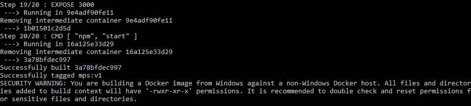
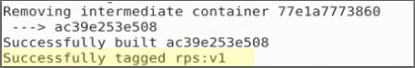
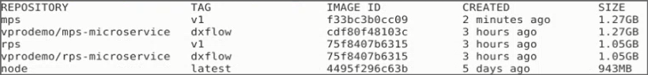
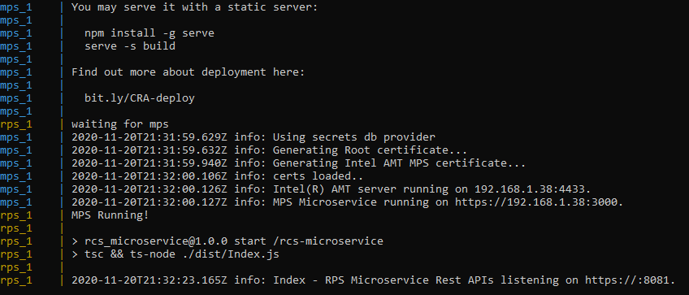
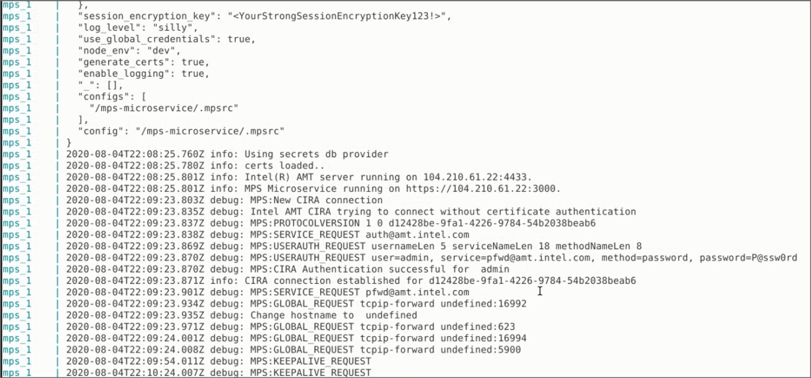

# Build and Deploy Docker* Images for MPS and RPS Locally

The Open AMT Cloud Toolkit's [Management Presence Server (MPS)](../Glossary.md#m) and [Remote Provisioning Server (RPS)](../Glossary.md#r) provide support for deploying the microservices as [Docker*](../Glossary.md#d) images, standardized packages containing an application's source code, libraries, environment, and dependencies. 

## Why Docker*?

A Docker container is the instantiation of a Docker image as a virtualized unit that separates the application from the environment. Docker containers start and run reliably, securely, and portably inside different environments, eliminating some of the usual problems that occur with software deployment on varying platforms. 

Get more information about Docker images and containers at [Docker resources.](https://www.docker.com/resources/what-container)

## Clone the MPS and RPS Repositories

**To clone the repositories:**

1\. Open a Command Prompt or Terminal and navigate to a directory of your choice for development.

``` bash
git clone https://github.com/open-amt-cloud-toolkit/mps.git
```
2\. Repeat to clone the RPS repository to the same parent directory as MPS.

``` bash
git clone https://github.com/open-amt-cloud-toolkit/rps.git
```

!!! Warning
    Do not nest a microservice directory inside another microservice directory. The source code contains relative paths. The correct directory structure appears below, where *parent* is your installation directory.

```
📦parent
 ┣ 📂mps
 ┗ 📂rps
```


## Build the Docker Images
Build the MPS and RPS Docker images from their respective directories with the `build -t` command, giving the image a name and tag:

[docker build . -t [name:tag]](https://docs.docker.com/engine/reference/commandline/build/)  

**Create name and tags that:**

- Contain lowercase letters, digits, and separators (i.e., underscores, periods, and dashes).
- Do not end with a separator.
- Contain up to 128 characters.

!!! Note
    Building a fresh Docker image may take several minutes.

**To build MPS:**

1\. Navigate to MPS folder and build the Docker image. 

```
cd ../mps
docker build . -t mps:v1
```
 

!!! Note
    On completion, a security warning is normal during local setup with the default values for developer testing environments.

**To build RPS:**

2\. Navigate to the RPS folder and build the Docker image.

```
cd ..
cd rps
docker build . -t rps:v1
```
 
   
## Set the Environment Variables  

**To set the environment variables:**

1\. After building the new MPS and RPS images, navigate to the `mps\scripts\docker-compose` folder and copy the .env.template file to `.env`. 

```
cd ..
cd mps/scripts/docker-compose
```

=== "Windows"
    ```
    copy .env.template .env
    ```

=== "Linux"
    ```
    cp .env.template .env
    ```

!!! Note
    Always preserve the .env.template file by copying it to a new file. 

2\. Open the .env file in a text editor. Set the image-related environment variables within the .env file.

Change the following fields:

| Field      |  Change to    |
| :----------- | :-------------- |
| **RPS_IMAGE** | rps:v1 | 
| **MPS_IMAGE** | mps:v1 | 
| **MPS_COMMON_NAME** | Your development system's IP address |

!!! Note
    Forgot the name and tag from the build? The **docker images** command lists repository names, tags, image IDs, and sizes. 

> ```
> docker images
> ```
>
> 

<!-- 5. Set the proper proxy values if behind a proxy.

   HTTP_PROXY=http://[your-proxy-server]:[your-proxy-server-port]
   HTTPS_PROXY=http://[your-proxy-server]:[your-proxy-server-port]

   ```
   HTTP_PROXY=http://10.16.01.01:3030
   HTTPS_PROXY=http://10.16.01.01:3030
   ```

   > **NOTE: Behind a Corporate Proxy?**
   >
   > To download images and install npm packages inside a container on start, modify settings in ~/docker/config.json to reflect the correct proxy address. 
   >
   > For more information about how to modify the proxy settings, see [Configure Docker Client](https://docs.docker.com/network/proxy/#configure-the-docker-client).
   > -->

## Run docker-compose

The environment file .env now contains the MPS and RPS environment variables to pass to the Docker engine. 

**To run docker-compose:**

1\. Navigate to the the `mps/scripts/docker-compose` directory. 

2\. Run the `docker-compose up` command, which starts the containers. approximately 2-3 minutes to start the containers.

```
docker-compose up
```
!!! Note
    While the `docker-compose up` command is running, you may see a pop-up ask for permission for Docker Desktop Filesharing. You must select **Share it** for the `docker-compose up` command to execute successfully.  If the pop-up expires,`docker-compose up` will fail.  You must run `docker-compose down` and then rerun `docker-compose up` to successfully start the containers.


<br>

Successful Output:




<!-- ## Check Logs
Alternatively, run `docker-compose up -d` to start the containers in the background.  To view the logs in a separate window, follow the steps below.

Check the logs to ensure the MPS and RPS services are properly handling the traffic from end devices. 

1. Allow the previous command line window for mps and rps to continue to run. Open a new command line window to run the **docker-compose logs** command. 
2. Navigate to the docker-compose folder

3. Type the **docker-compose logs** command.

   docker-compose logs [name of service]

   ```
   docker-compose logs mps
   ```
    
   A log file may provide information for troubleshooting these problems: -->


## Next up
[**Login to RPS**](../General/loginToRPS.md)
