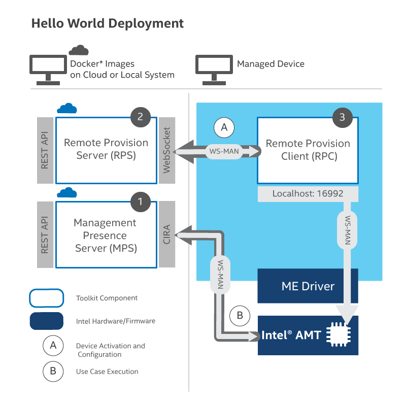

# Build and Deploy Microservices with Local Docker* Images

## Overview

This section outlines the setup of the ActivEdge's microservices and client application. Take this path to install MPS and RPS as Docker images that will function as services on a local system or the cloud as in Figure 1.

**Figure 1: Microservices deployed as Docker images**

## What You'll Need

**Hardware**

At minimum, to install and use the ActivEdge, a network configuration must include:

-  A development PC 
-  At least one Intel® vPro device

Both systems must use a wired (i.e., cable) connection on the same network.

**Software**

- The **development PC** hosts Management Presence Server (MPS) and Remote Provisioning Server (RPS) and requires the following software:

    - [Docker Desktop](https://www.docker.com/products/docker-desktop) for Windows* or Linux*

        Docker Configuration Details:

        - The Docker for Windows installer defaults to enable all the required settings for this tutorial.
        - After successful installation, the Docker icon (whale), will appear on the task bar.
        - To troubleshoot the installation, [see the troubleshooting guide](https://docs.docker.com/docker-for-windows/troubleshoot/).

    - [Chrome* Browser](https://www.google.com/chrome)

    - [git](https://git-scm.com/downloads)

- The **managed device (test client), with Intel® vPro** runs the Remote Provisioning Client (RPC) and requires the following software:

      - [git](https://git-scm.com/downloads)

      - [Microsoft* Visual Studio](https://visualstudio.microsoft.com/), 2017 or newer version 
    
      >Note: Microsoft* Visual Studio on the managed devices is not typical for production environments. This is for demonstration purposes.
      >

## What You'll Do

Follow the steps in these sections sequentially to deploy Docker* images on a local development system: 

- Build and Deploy Docker* Images Locally
- Configure RPS
- Build RPC on Managed Device
- Manage Device

Run instructions in these sections can use Microsoft Windows* or Linux* environments. The terminal may be A) the Windows Command Prompt in Administrator mode or B) the Linux* shell/terminal. 

Estimated completion time:** 15 minutes

## Next up
[Build Docker* Images](dockerLocal.md)

  

