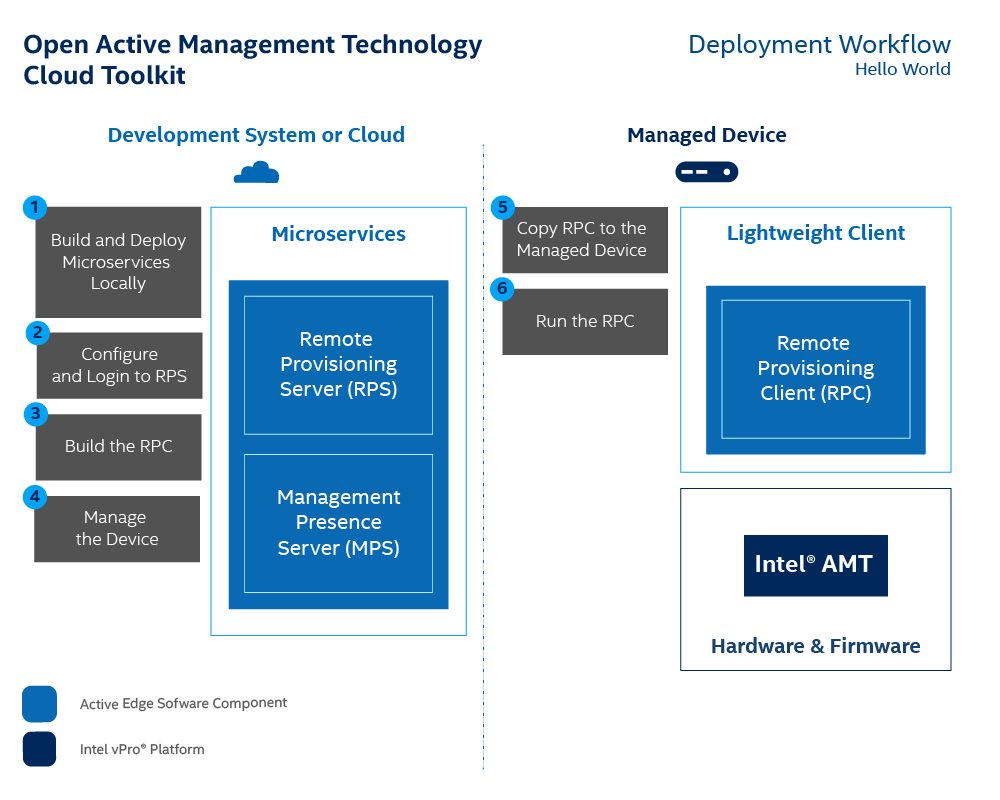

# Build and Deploy Microservices with Local Docker* Images

This section contains instructions for deploying the  Open AMT Cloud Toolkit's [Management Presence Server (MPS)](../Glossary.md#m) and [Remote Provisioning Server (RPS)](../Glossary.md#r) on a local development system as Docker* images. These Hello World deployment instructions detail how to install the microservices manually on a development system and are not intended as production environment instructions.

**Figure 1: Deploy microservices on a local development system as Docker images. **

## What You'll Need

###Hardware

**Configure a network that includes:**

-  A development system 
-  At least one Intel vPro® device
-  A flash drive or equivalent means to transfer files between

Both systems must use a wired (i.e., cable) connection on the same network.

###Development System Software

**Before MPS and RPS installation, install the following software:**

- [Docker* Desktop](https://www.docker.com/products/docker-desktop) for Windows* or Linux*
  
!!! Info
    **Docker Configuration Details: **
    (1) The Docker for Windows installer defaults to enable all the required settings for this tutorial.
    (2) After successful installation, the Docker icon (whale), will appear on the task bar. 
    (3) To troubleshoot the installation, [see the troubleshooting guide](https:/docs.docker.com/docker-for-windows/troubleshoot/).

- [Chrome* Browser](https://www.google.com/chrome)
- [git](https://git-scm.com/downloads)

**If running Windows on the development system, also install:**
    
- [Microsoft Visual Studio*](https://visualstudio.microsoft.com/): 2019 or newer version of Visual Studio Community/Professional

      

## What You'll Do

**To complete a Hello World microservice deployment:**

- Build and Deploy Docker* Images Locally
- Login and Configure RPS
- Build RPC
- Copy RPC to a Managed Device

**To connect the managed device:**

- Run RPC on a Managed Device
- Manage the Device with MPS

These sections include instructions for Windows and Linux* environments. Run instructions in a terminal window, the Windows Command Prompt in Administrator mode or the Linux shell/terminal.

Estimated completion time: **15 minutes**

## Next up
[**Build Docker* Images**](dockerLocal.md)

