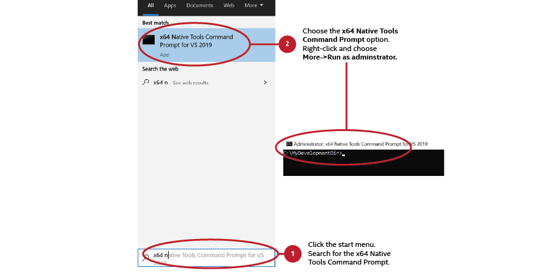
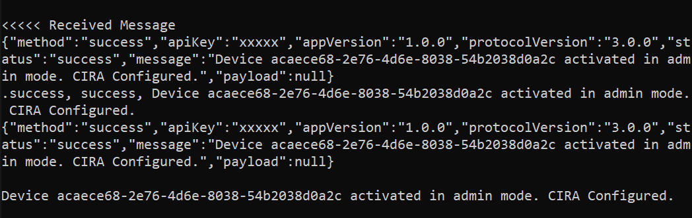

Estimated completion time:

- 30 minutes on Windows 10 devices (20-25 minutes are required installation time estimates)
- 15 minutes on Linux devices


## Remote Provisioning Client

The Remote Provisioning Client (RPC) communicates with the Manageability Engine Interface (MEI) and RPS interfaces. The MEI uses the ME Driver to talk to Intel AMT. By running RPC, we will activate Intel AMT into Client Control Mode (CCM), or ACM based on the created profile, as well as configure the CIRA connection of the AMT device to the MPS. After successfully running, the AMT device will be ready to be managed remotely using the web interface!

!!! tip "Production Environment"
        In a production environment, RPC can be deployed with an in-band manageability agent to distribute it to the fleet of AMT devices. The in-band manageability agent can invoke RPC to run and activate the AMT devices.

[](../assets/images/RPC_Overview.png)


### Clone the Repository

1. On your development system, navigate to a directory of your choice to clone and build RPC.

2. Clone the RPC repository.

    ``` bash
    git clone --branch ActivEdge https://github.com/open-amt-cloud-toolkit/rpc.git && cd rpc
    ```

### Install Prerequisites

=== "Windows"
    Open 'x64 Native Tools Command Prompt for VS 20XX' as Administrator on your development system.  **This is NOT a regular Windows Command Prompt.**  This specific tool is used for compiling the RPC executable.
    
    

    Build VCPKG


    1. In the `rpc` directory, clone the Vcpkg repository. Vcpkg is a C/C++ Library Manager for Windows that was created by Microsoft.  Find out more about it [here](https://github.com/microsoft/vcpkg).

        ``` bash
        git clone --branch 2020.01 https://github.com/microsoft/vcpkg.git && cd vcpkg
        ```

    2. Build `vcpkg.exe` using the following command:

        ``` bash
        bootstrap-vcpkg.bat
        ```
        
    3. Set up user-wide integration in order to allow Vcpkg to work with Visual Studio. 

        ``` bash
        vcpkg integrate install
        ```

    Build CPPRestSDK

    1. Make sure you are still in the ../vcpkg directory.

    2. Install the C++ REST SDK package using Vcpkg. C++ REST SDK is a library for cloud-based client-server communication with modern API design.  Find out more about it [here](https://github.com/microsoft/cpprestsdk).

        !!! note
            This will take 15–25 minutes, depending on download speeds.

        ``` bash
        vcpkg install cpprestsdk:x64-windows-static
        ```
    3. Navigate back to the `./rpc` directory

        ``` bash
        cd ..
        ```

=== "Linux"
    1. To install the required dependencies; enter the following command:

        ``` bash
        sudo apt install git cmake build-essential libboost-system-dev libboost-thread-dev libboost-random-dev libboost-regex-dev  libboost-filesystem-dev libssl-dev zlib1g-dev
        ```

### Build RPC
    
1. Create a new directory called `build` within the `./rpc` directory and change to it.

    ``` bash
    mkdir build && cd build
    ```

2. Run the following commands to build RPC.

    === "Windows"

        Generate the CMake config
        ``` bash
        cmake .. -DVCPKG_TARGET_TRIPLET=x64-windows-static -DCMAKE_TOOLCHAIN_FILE=../vcpkg/scripts/buildsystems/vcpkg.cmake
        ```

        Build the RPC executable
        ```bash
        cmake --build . --config Debug
        ```

        Change to Debug directory
        ``` bash
        cd Debug
        ```

        Save the rpc.exe file to a flash drive or other means to transfer to the managed device.
            
    === "Linux"
        ``` bash
        cmake -DCMAKE_BUILD_TYPE=Debug ..
        cmake --build .
        ```

        Save the new 'rpc' file in the Build directory to a flash drive or other means to transfer to the managed device.


### Run RPC to Activate and Connect the AMT Device

1. Using a Flash Drive or other method, transfer the Debug folder to the managed device.

2. On the managed device, run RPC with the following command to activate and configure Intel&reg; AMT. It will take 1-2 minutes to finish provisioning the device.

- Replace [Development-IP-Address] with the development system's IP address, where the MPS and RPS servers are running
- Replace [profile-name] with your created profile from the Web Server.

=== "Windows"
    ```
    rpc.exe -u wss://[Development-IP-Address]:8080 -c "-t activate --profile [profile-name]"
    ```
=== "Linux"
    ``` bash
    sudo ./rpc -u wss://[Development-IP-Address]:8080 -c "-t activate --profile [profile-name]"
    ```


Example Success Output:

[](../assets/images/RPC_Success.png)


!!! tip "Production Environment"
        In a production environment, an in-band agent would invoke this command with the parameters rather than a manual command.

!!! note "Troubleshooting"
        The rpc.exe generates this message:
                Unable to get activation info. Try again later or check AMT configuration.
        Verify that the x64 Native Tools Command Prompt for VS 20XX is running in **Administrator mode** on the managed device.
         
        
!!! note
    If you do not remember your created profile's name, you can navigate to the *Profiles* tab on the web server hosted at `https://[Development-IP-Address]:3000`

    **Default login credentials:**
    
    | Field       |  Value    |
    | :----------- | :-------------- |
    | **Username**| standalone |
    | **Password**| G@ppm0ym |


## Next up

After successfully building RPC activating the managed device, continue to MPS Device Management.

Continue here: [MPS Device Management](../General/manageDevice.md)
