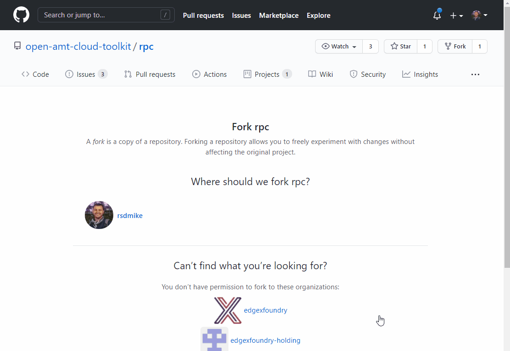

<!-- [](../assets/animations/forkandbuild.gif =500x) -->

## Build RPC 

We leverage GitHub Actions as a means to build RPC automatically leveraging Github's CI/CD Infrastructure. This avoids having to deal with the challenges of getting your build environment just right on your local machine and allows you to get up and running much faster. However, if you wish to do this locally, please follow the instructions [here](./buildRPC.md).

Read more about GitHub Actions [here](https://github.blog/2019-08-08-github-actions-now-supports-ci-cd/#:~:text=GitHub%20Actions%20is%20an%20API,every%20step%20along%20the%20way.)


1. First you'll want to create a fork of the repository.

    [Fork rpc on github](https://github.com/open-amt-cloud-toolkit/rpc/fork){: .md-button .md-button--primary }

2. Click on "Actions" and Select "Build RPC (Native)" Workflow

3. Click "Run Workflow", select branch "master", and click "Run Workflow"

4. Grab a coffee, as the build for Windows will take roughly 30 minutes and the build for linux will take roughly 5 minutes.

5. Once complete, click the completed job, and download the appropriate RPC for your OS under the "Artifacts" section.

## Run RPC to Activate and Connect the AMT Device

1. Run RPC with the following command to activate and configure Intel&reg; AMT. It will take 1-2 minutes to finish provisioning the device.

- Replace [IP-Address] with the IP address of the server where the MPS and RPS services are running
- Replace [profile-name] with your created profile from the Web Server.

=== "Windows"
    ```
    rpc.exe -u wss://[IP-Address]:8080 -c "-t activate --profile [profile-name]"
    ```
=== "Linux"
    ``` bash
    sudo ./rpc -u wss://[IP-Address]:8080 -c "-t activate --profile [profile-name]"
    ```