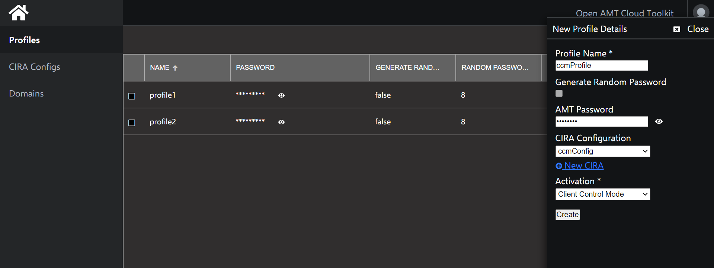

Intel® AMT devices are capable of being activated into two modes:

- [**Admin Control Mode (ACM):**](../Glossary.md#a) In this mode, there are no limitations to Intel AMT functionality. This reflects the higher level of trust associated with these setup methods. No user consent is required.

- [**Client Control Mode (CCM):**](../Glossary.md#c) This mode limits some of Intel AMT functionality, reflecting the lower level of trust.

    Features requiring User Consent:

    - Keyboard, Video, Mouse (KVM) Control
    - IDE-Redirection for sharing and mounting images remotely

**Figure 1: Set up configuration and profiles for N number of clients. **

## Create a Profile

[Profiles](../Glossary.md#p) provide configuration information to the AMT Firmware during the activation process with the [Remote Provisioning Client (RPC)](../Glossary.md#r).

**To create a CCM profile:**

1. Select the **Profiles** tab from the menu on the left.

2. Under the **Profiles** tab, click **New** in the top-right corner to create a profile.

3. Specify a **Profile Name** of your choice.

4. Uncheck **Generate Random Password.**
   
    !!! tip "Production Environment"
        In a production environment, you typically generate a random password for each AMT device to create a stronger, more secure AMT environment.

5. Provide a strong **AMT Password**.

    !!! important
        This password must meet standard, **strong** password requirements:

        - 8 to 32 characters

        - One uppercase, one lowercase, one numerical digit, one special character

6. Select the name of the **CIRA Configuration** you created previously from the drop-down menu.

7. Under **Activation**, select **Client Control Mode ** from the dropdown menu.

8. Click **Create.**

    !!! example
        Example Profile:

        

## Next up
**[Build RPC](buildRPC.md)**

