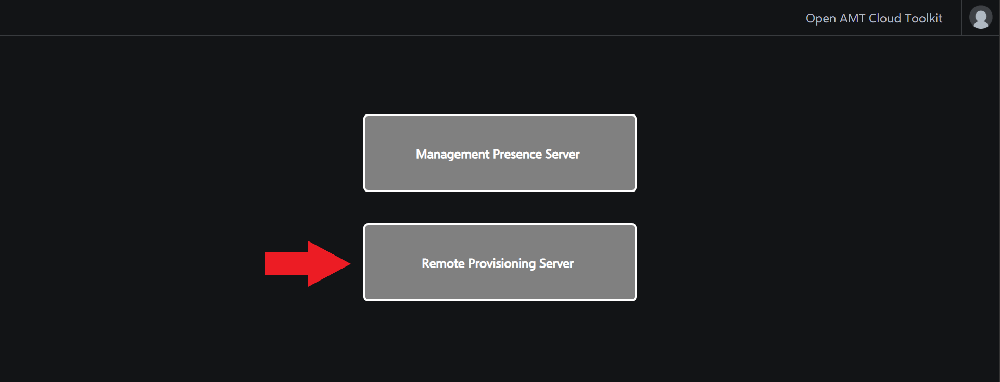

## Log in to the Web Server

1. Open Chrome* browser and navigate to the web server using your development system's IP address on port 3000.

    ```
    https://[Development-IP-Address]:3000
    ```

    !!! important
        You must use an IP Address to connect to the web server. Using `localhost` will not work.

2. Because we are using self-signed certificates, we will be prompted by a warning screen. Click Advanced, then Proceed to continue to connect to the webserver.

3. Log in to the web portal with the credentials below.

    **Default credentials:**

    | Field       |  Value    |
    | :----------- | :-------------- |
    | **Username**| standalone |
    | **Password**| G@ppm0ym |

4. Select Remote Provisioning Server on the web portal.

[](../assets/images/WebUI_HomeRPS.png)

## Next up
[Create a CIRA Config](createCIRAConfig.md)
