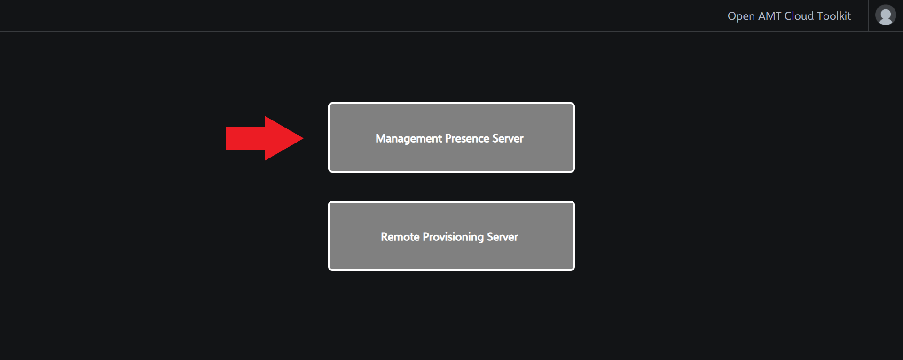

Estimated completion time: 5 minutes

## Manage the Intel&reg; AMT Device using MPS

1\. On your development device, browse to the web server using the development device's IP Address.
	
**Example URL:** https://[Development-IP-Address]:3000

2\. Log in with the default credentials below.

**Default credentials:**

| Field       |  Value    |
| :----------- | :-------------- |
| **Username**| standalone |
| **Password**| G@ppm0ym |

3\. After logging in, click on Management Presence Server.

 

4\. Click the devices tab from the menu on the left, or click *Connected* in the default homepage.

>**Note:** If the activated device is not listed or if it is listed as unconnected, unplug the power of the AMT device and boot the machine. After succesfully restarting, refresh the WebUI to see if the *Status* changes to *Connected* and turns green.

5\. Select the checkbox by the connected device you want to manage.

6\. Select an action to perform from the options on the right.

>**Note:** Since the device was activated in Client Control Mode(CCM), the KVM feature will not function in this current release. To use KVM, follow the [ACM Activation Tutorial](../Tutorials/acmActivation.md) to see how to configure a device into Admin Control Mode.

>**Note:** Activated in Admin Control Mode already? Try out the Keyboard, Video, Mouse (KVM) feature to remotely view and control the AMT device.  Issue a Reset to BIOS command and be able to view and make live changes to BIOS settings.

 

Next steps: 

- Learn how to construct your own API call to manage a device [here](../Tutorials/apiTutorial.md)
- Find out about the ActivEdge [UI Toolkit](../Tutorials/uitoolkit.md) and more under Tutorials.
- Read about security recommendations and other ActivEdge features under Topics.

 

