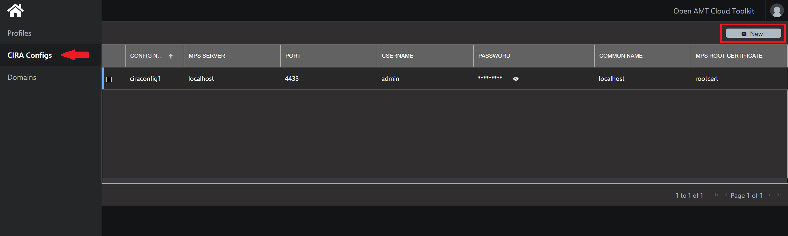
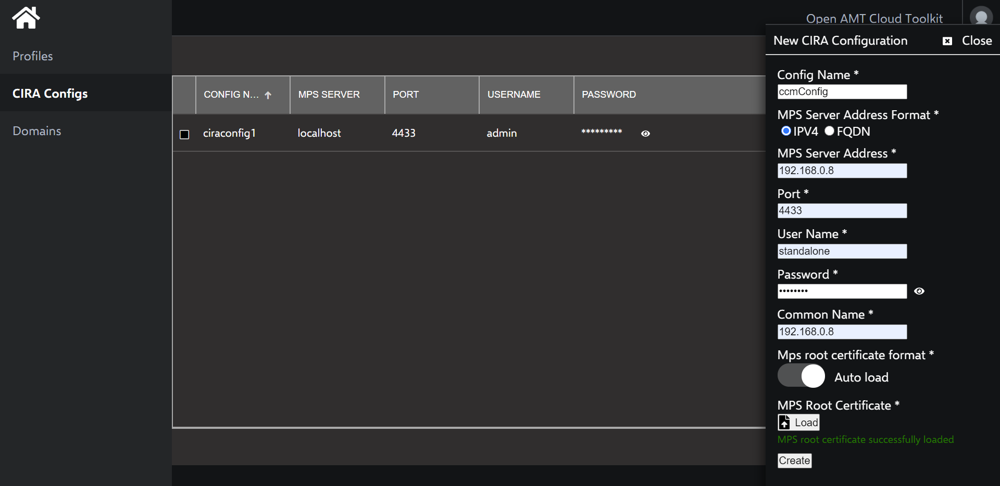

# Configure RPS

## Logging in to the HTTPS Web Server

1\. Open Chrome* and navigate to the web server using your development device's IP address on port 3000.

```
https://[Your-IP-Address]:3000
```

>**Note:** You must use an IP address to connect to the web server. Using *localhost* will not work.

2\. Log in with the *web_admin_user* and *web_admin_password* values set in the .mpsrc file. If you changed these parameters, enter your customized login, or use the defaults provided below.

**Default credentials:**

| Field       |  Value    |
| :----------- | :-------------- |
| **web_admin_user**| standalone |
| **web_admin_password**| G@ppm0ym |

3\. Select Remote Provisioning Server.

>**Note:** Until an Intel<sup>®</sup> AMT device connects to the MPS, the number of devices shown on the Management Presence Serveroption will remain at 0. When you configure a device, you will see a new, 'Disconnected' device.  Once you successfully activateand connect the device (using CIRA), you'll see it listed as a 'Connected' device.


## Add CIRA Configuration and Profile to RPS

### Create a CIRA Config

CIRA stands for Client Initiated Request Access.  It allows a CIRA-capable edge device to reach out and establish a persistent connection to the MPS server rather than the MPS server reaching to the edge device.  This enables access to edge devices that might be harder to reach behind things such as proxies/firewalls/etc.

A CIRA configuration provides the Remote Provisioning Client (RPC) the required info to establish the edge device's CIRA connection to the MPS Server during the activation process.  

<br>

1\. Select the CIRA Configs tab from the left-hand menu.

2\. In the top-right corner, click New.

[](../assets/images/RPS_NewCIRAConfig.png)

3\. Specify a Config Name of your choice.

4\. Select IPV4,and provide your server's IP address.

5\. Set Port to the default, 4433.

6\. Set User Name and Password to the following:

| Field       |  Value    |
| :----------- | :-------------- |
| **User Name**| standalone |
| **Password**| G@ppm0ym |
    
>**Note:** For this guide, we are using the default values above. The User Name and Password fields in the CIRA Config must match the *mpsuser* and *mpspass* values set in the `.mpsrc` file in .\mps during the setup and installation of MPS.

7\. Provide your device's IP address as the Common Name.

8\. Click Load under MPS Root Certificate.

9\. Click Create.

Example CIRA Config:
    
[](../assets/images/RPS_CreateCIRAConfig.png)

<br>

### Create a Profile

Profiles provide configuration information to the AMT Firmware during the activation process with the Remote Provisioning Client (RPC).  It sets the AMT Password, used to access the Intel MEBX (Management Engine BIOS Extension) on the device and during the AMT deactivation process.

Profiles also distinguish between activating a device in Client Control Mode (CCM) or Admin Control Mode (ACM). In this guide, we will activate into Client Control Mode. For more information on Admin Control Mode and the differences, [click here](../Tutorials/acmActivation.md).

!!! note "Production Environment"
        In a production environment, devices are typically activated in ACM mode.  ACM mode enables KVM access to devices without user consent. In most IoT use cases, edge devices such as digital signage or kiosks may not have immediate access to it or employees nearby.  ACM mode proves immensely helpful in these scenarios.

<br>

1\. Select the Profiles tab from the menu on the left.

2\. Under the Profiles tab, click New in the top, right corner to create a profile.

3\. Specify a Profile Name of your choice.

4\. Uncheck Generate Random Password.

5\. Provide a strong AMT Password. 
    
>**Note:** This password must meet standard, 'strong' password requirements:    
>> - 8 to 32 characters
>> - One uppercase, one lowercase, one numerical digit, and one special character

6\. Select the name of the CIRA Config you created previously from the drop-down menu.

7\. Under Activation, select 'ccmactivate' from the drop-down menu.

>**Note:** If you'd prefer to activate the device into ACM mode, click [here](../Tutorials/acmActivation.md)

8\. Click Create.

Example Profile:

[](../assets/images/RPS_CreateProfile.png)

Click the **Next** link at the bottom right of the page to build RPC on a managed device.
