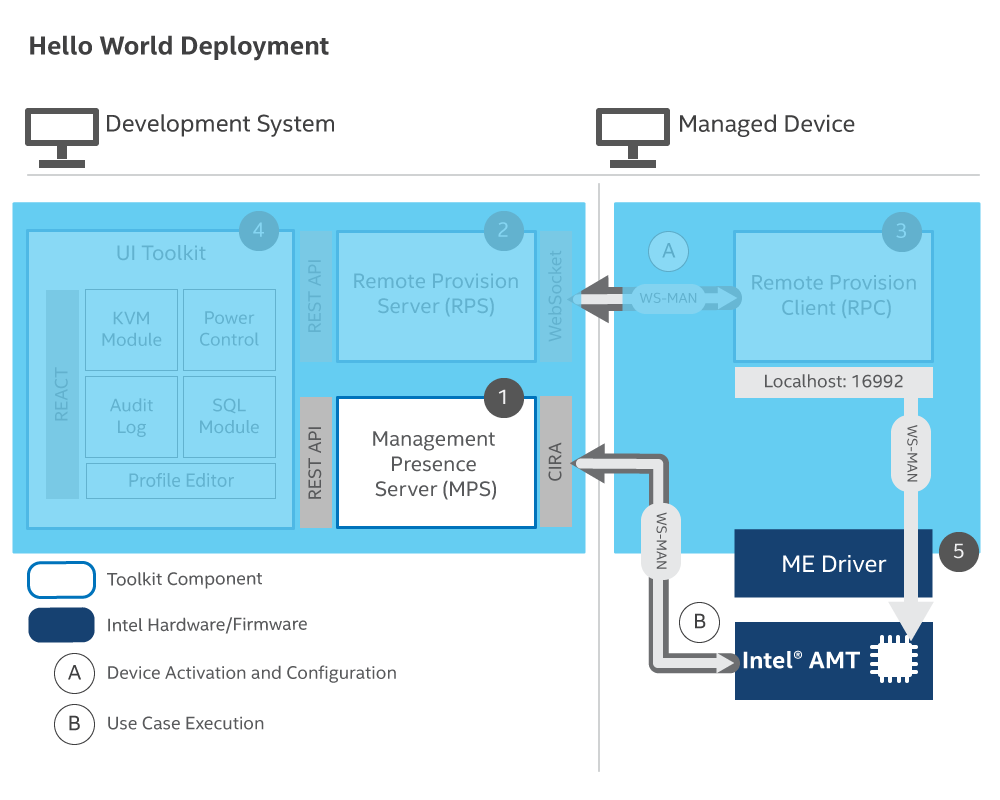
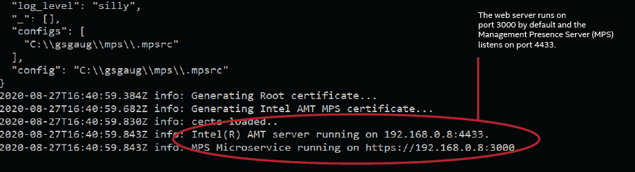

The Management Presence Server is a cloud-agnostic microservice that enables platforms featuring Intel&reg; AMT to be managed over the internet. This section details how to set up the MPS on a development device.

The image below illustrates how the Intel&reg; AMT device connects to MPS for remote management.

[](../assets/images/MPS_Overview.png)

### Clone the Repository

1\. Open a Command Prompt or Terminal and navigate to a directory of your choice for development.

2\. Clone the MPS repository and navigate to it with the following commands:

```
git clone --branch ActivEdge https://github.com/open-amt-cloud-toolkit/mps.git
cd mps
```

### Modify MPS Configuration File

1\. Open the `.mpsrc` file, within the mps directory, using a text editor of your choice to configure settings, such as Notepad on Windows or Text Edtior on Linux.

2\. Configure the following settings:

| Field       |  Change to    | Description |
| :----------- | :-------------- | :- |
| **use_allowlist** | false |A value of false disables the allowlist functionaliy. For information about allowlist, see the allowlist [tutorial](../Tutorials/allowlist.md) |
| **common_name** | Development device's IP address. <br> **Note:** For this guide, you **cannot** use localhost because the managed device would be unable to reach the MPS and RPS servers. | For this guide, the address will be used in a self-signed certificate. It may be an IP address or FQDN in real world deployment.|


3\. Save and close the file.

<br>

Example .mpsrc file:

```json hl_lines="2 3"
  {
      "use_allowlist" : false,
      "common_name": "192.168.0.8",
      "port": 4433,
      "username": "standalone",
      "pass": "G@ppm0ym",
      "use_global_mps_credentials": true,
      "country": "US",
      "company": "NoCorp",
      "debug": true,
      "listen_any": true,
      "https": true,
      "tls_offload": false,
      "web_port" : 3000,
      "generate_certificates": true,
      "logger_off":false,
      "web_admin_user": "standalone",
      "web_admin_password": "G@ppm0ym",
      "vault_address": "http://localhost:8200",
      "vault_token": "myroot",
      "use_vault": true,
      "secrets_path": "secret/data/",
      "cert_format" : "file",
      "data_path" : "../private/data.json",
      "cert_path": "../private",
      "mpsxapikey": "APIKEYFORMPS123!",
      "mps_tls_config" : {
        "key": "../private/mpsserver-cert-private.key",
        "cert": "../private/mpsserver-cert-public.crt",
        "requestCert": true,
        "rejectUnauthorized": false,
        "minVersion": "TLSv1",
        "ciphers": null,
        "secureOptions": ["SSL_OP_NO_SSLv2", "SSL_OP_NO_SSLv3"]
      },
      "web_tls_config" : {
        "key": "../private/mpsserver-cert-private.key",
        "cert": "../private/mpsserver-cert-public.crt",
        "ca": ["../private/root-cert-public.crt"],
        "secureOptions": ["SSL_OP_NO_SSLv2", "SSL_OP_NO_SSLv3", "SSL_OP_NO_COMPRESSION", "SSL_OP_CIPHER_SERVER_PREFERENCE","SSL_OP_NO_TLSv1", "SSL_OP_NO_TLSv11"]
      }
  }

```

### Configure the WebUI

1\. Navigate to the `src` directory in .\mps\webui\src\

```
cd webui/src
```

2\. Open the app.config.js file using a text editor to configure IP Address settings.

3\. Replace the localhost for both *rpsServerIP* and *serverIP* with your development device's IP Address. Save and close the file.

Example:

``` javascript hl_lines="4 5"
  const validExtensions = ['.png', '.jpeg', '.jpg', '.svg'];
  const port = process.env.REACT_APP_MPS_WEB_PORT? process.env.REACT_APP_MPS_WEB_PORT : 3000;
  const rpsPort = process.env.REACT_APP_RPS_WEB_PORT ? process.env.REACT_APP_RPS_WEB_PORT : 8081;
  const rpsServerIP = process.env.REACT_APP_RPS_SERVER ? process.env.REACT_APP_RPS_SERVER : '192.168.0.8';
  const serverIP = process.env.REACT_APP_MPS_SERVER ? process.env.REACT_APP_MPS_SERVER : '192.168.0.8';
  const mpsAPIKey = process.env.REACT_APP_MPSXAPIKEY ? process.env.REACT_APP_MPSXAPIKEY : 'APIKEYFORMPS123!';
  const rpsAPIKey = process.env.REACT_APP_RPSXAPIKEY ? process.env.REACT_APP_RPSXAPIKEY : 'APIKEYFORRPS123!'
  const Config = {
    ...
};
```

<br>

4\. Navigate back to the `./mps` root directory.


5\. Run the install commands to install all required dependencies.

```
npm install
```

### Start the MPS Server
Start the MPS server. The web server runs on port 3000 by default, and the MPS Server listens on port 4433. It will take approximately 2–3 minutes to start.
    
```
npm run dev
```

>**Note:** The development device's IP Address will be used to connect to the web server.

[](../assets/images/MPS_npmrundev.png)

>**Note:** Because the *generateCertificates* field is set to true in the .mpsrc file, certificates will be generated and stored in the ../mps/private directory.

<br>

## Next up
[Install RPS Locally](installRPS.md)
