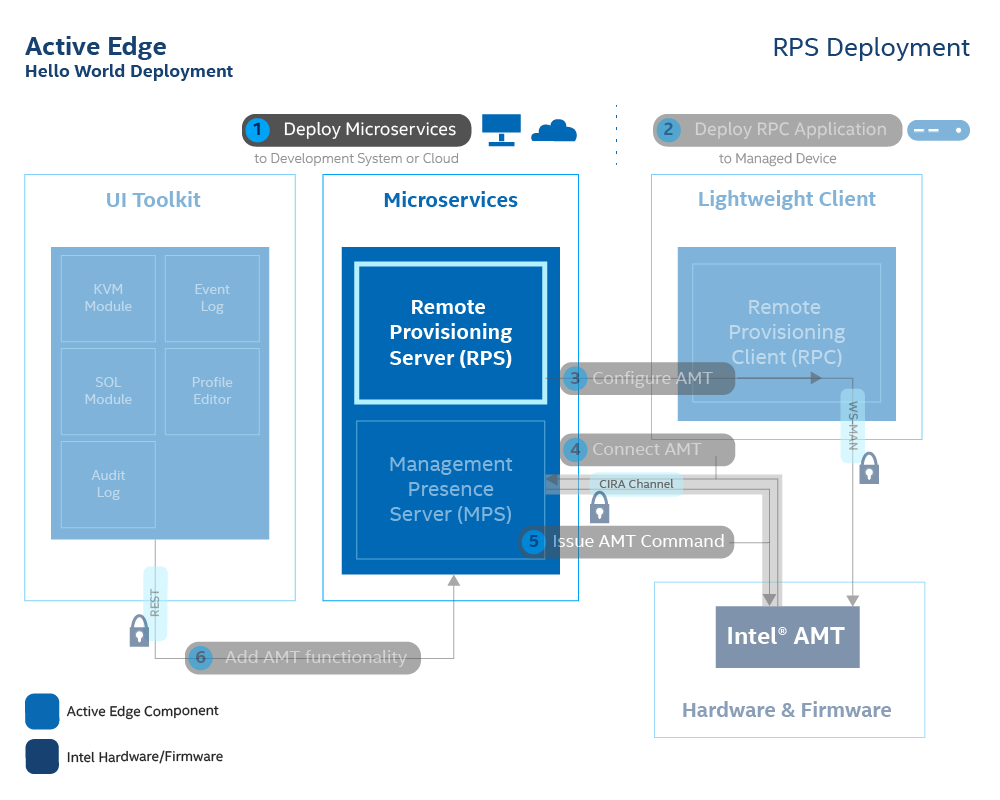
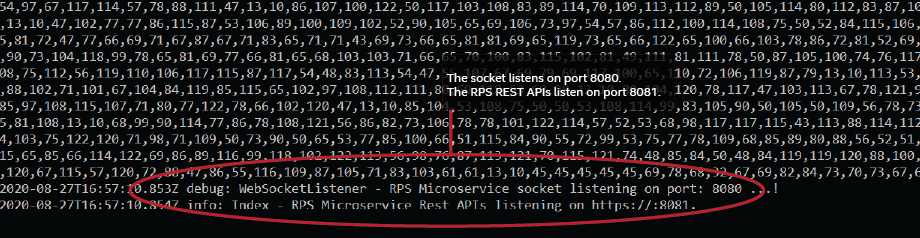

The Remote Provisioning Service (RPS) is a microservice based on Node.js*. The RPS works with the Remote Provisioning Client (RPC) to activate Intel&reg; AMT platforms using a pre-defined profile.

Figure 1 illustrates where RPS fits into the overall microservice architecture.

[](../assets/images/RPSDeployment.png)

**Figure 1: Deploy Remote Provisioning Server (RPS) on a development system.**

## Clone the Repository

**To clone the repository:**

1. Open a new Command Prompt or a Terminal. The MPS server will continue to run in your previous Command Prompt or Terminal.

2. Clone the RPS repository to the same parent directory where the mps directory is located. 

```
git clone --branch ActivEdge https://github.com/open-amt-cloud-toolkit/rps.git && cd rps
```

!!! Warning
    Do not nest a microservice directory inside another microservice directory. The source code contains relative paths. The correct directory structure appears below, where *parent* is the your installation directory.
    
```
📦parent
 ┣ 📂mps
 ┗ 📂rps
```


## Start the RPS Server

**To start the RPS:**

1. In the ```rps``` directory, run the install command to install all required dependencies. 

    ``` bash
    npm install
    ```

2. Then, start the server. By default, the RPS web port is 8080.

    ``` bash
    npm run dev
    ```

    !!! note
        Warning messages are okay and expected for optional dependencies.

    Example Output:

    [](../assets/images/RPS_npmrundev.png)

**Figure 2: RPS reports successful deployment.**

## Next up
[Login to RPS](../General/loginToRPS.md)
