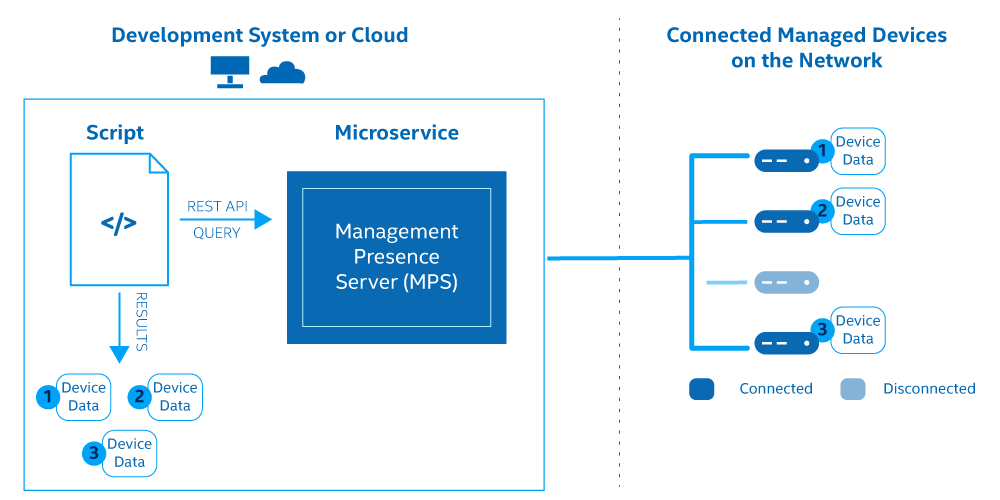

This tutorial demonstrates how to construct an Admin method API call for [*ConnectedDevices*](../APIs/MPSmethods/connecteddevices.md) using Node.js. The ConnectedDevices method will retrieve information about connected devices, including device GUIDs.

[](../assets/images/ConnectedDevicesAPI.png)

**Figure 1: Admin Method API Call for Connected Devices**

>**Note:** Successfully deploy the Management Presence Server (MPS) and Remote Provisioning Server (RPS) and connect an Intel® vPro device to MPS before constructing the API call. Start **[here](../Local/overview.md)** to install microservices locally or **[here](../Docker/overview.md)** to install microservices locally with Docker*.

Modify the tutorial template to implement other MPS REST APIs by changing these values:

- method
- payload
- path 

View all available MPS methods [here](../APIs/indexMPS.md).

## What You'll Need

**Hardware**

A minimum network configuration must include:

-  A Development system with Windows® 10 or Ubuntu 18.04 or newer
-  An Activated and Configured Intel® vPro device as the managed device

**Software on the Development System** 

- MPS
- RPS
- [Node.js LTS 12.x.x or newer](https://nodejs.org/)
- [Visual Studio Code](https://code.visualstudio.com/) or any other IDE
    
  
## What You'll Do
The following sections describe how to:

- Construct an Admin API Call to MPS for connected devices
- View Device GUIDs

## Construct an Admin Method API Call for Connected Devices

1\. Navigate to a file directory of your choice.

2\. Create and open a new JavaScript* file with a name of your choice. In this guide we will refer to it as *SampleAPI.js*.

3\. Copy and paste the example code below.

4\. Replace *MPS-Server-IP-Address* with the IP Address of your development system or MPS server.

>**Note:** The ConnectedDevices method uses the **admin** path. MPS methods use either **admin** or **amt** as the path. View the difference and all MPS methods [here](../APIs/indexMPS.md).

!!! note "Security Information"
        By running MPS in Dev Mode, authentication is disabled for testing and demonstration purposes. In production, the MPS certificate needs to be signed by a Certificate Authority. Also, an API Key value must be given in the headers of the API request.

!!! example
    Example SampleAPI.js file:

    ```javascript hl_lines="12"
        const https = require('https')
        process.env['NODE_TLS_REJECT_UNAUTHORIZED'] = 0 //For testing with self-signed certs, remove for production
        let postData = {
            'method': 'ConnectedDevices', //Retrieve all Devices Connected to MPS
            'payload': {
                //Some methods such as PowerAction require a payload. 
                //This one does not as it just retrieves data of all connected devices.
            }
        }
        
        const options = {
            hostname: 'MPS-Server-IP-Address', //Your Development System's IP or MPS Server IP
            port: '3000',
            path: '/admin', //Supports admin and amt paths. See MPS API Docs for which to use for other different methods.
            method: 'POST',
            headers: {
                'Content-Type': 'application/json',
                'X-MPS-API-KEY': 'APIKEYFORMPS123!'
            }
        }
        
        const req = https.request(options, (res) => {
            res.setEncoding('utf8')
            res.on('data', (chunk) => {
                console.log(chunk)
            })
            res.on('end', () => {
                console.log('No more data in response.')
            })
        })
        
        req.on('error', (e) => {
            console.error(`problem with request: ${e.message}`)
        })
        
        // Write data to request body
        req.write(JSON.stringify(postData))
        req.end()

    ```

<br>

## Execute the REST API

1\. Open a Command Prompt or Terminal to execute the call.

2\. Navigate to the directory you saved the SampleAPI.js file.

3\. Run the code snippet using node.

```
node SampleAPI.js
```

Example Response:

!!! important
    This is one way to retrieve a device's GUID in the *host* field.  **For *amt* path methods (i.e. Power Actions, Audit Logs, etc), the device GUID is *required* as part of the POST data.** Save this value if you want to try other MPS methods. Other ways to retrieve a GUID can be found [here](../Topics/guids.md).


!!! example
    Example Command Prompt Output:

    ```json
        response :  [{"host":"d12428be-9fa1-4226-9784-54b2038beab6",
        "amtuser":"admin","mpsuser":"standalone","icon":1,"conn":1,
        "name":"d12428be-9fa1-4226-9784-54b2038beab6"}  ]
    ```
    Example JSON Pretty Print:

    ```json
        [{
            "host": "d12428be-9fa1-4226-9784-54b2038beab6",
            "amtuser": "admin",
            "mpsuser": "standalone",
            "icon": 1,
            "conn": 1,
            "name": "d12428be-9fa1-4226-9784-54b2038beab6"
        }]

    ```

<br>

## Construct Other MPS Methods

To adapt the above code snippet to work with a different MPS method of your choice, follow the below steps.

1. Select a method from the [MPS API Documentation](../APIs/indexMPS.md)

2. Update the method field in postData with the name of the method.

3. Copy and paste the payload if the method requires it. If necessary, replace the guid field inside the payload with the AMT device's GUID.

4. Update the path field to either **/admin** or **/amt**

5. Save and run the Javascript file.

!!! example
    Highlighted fields should be updated:

    ```javascript hl_lines="4 5 6 7 8 12 14"
        const https = require('https')
        process.env['NODE_TLS_REJECT_UNAUTHORIZED'] = 0 //For testing with self-signed certs, remove for production
        let postData = {
            'method': 'ConnectedDevices', //Retrieve all Devices Connected to MPS
            'payload': {
                //Some methods such as PowerAction require a payload. 
                //This one does not as it just retrieves data of all connected devices.
            }
        }
        
        const options = {
            hostname: 'MPS-Server-IP-Address', //Your Development System's IP or MPS Server IP
            port: '3000',
            path: '/admin', //Supports admin and amt paths. See MPS API Docs for which to use for other different methods.
            method: 'POST',
            headers: {
                'Content-Type': 'application/json',
                'X-MPS-API-KEY': 'APIKEYFORMPS123!'
            }
        }
        
        const req = https.request(options, (res) => {
            res.setEncoding('utf8')
            res.on('data', (chunk) => {
                console.log(chunk)
            })
            res.on('end', () => {
                console.log('No more data in response.')
            })
        })
        
        req.on('error', (e) => {
            console.error(`problem with request: ${e.message}`)
        })
        
        // Write data to request body
        req.write(JSON.stringify(postData))
        req.end()

    ```

<br>

## Other Methods

The sample Node code snippet can be adapted for other MPS and RPS methods. To learn more, see: 

- [MPS Methods to manage a device](../APIs/indexMPS.md).

- [RPS Methods for server configuration and provisioning](../APIs/indexRPS.md).

## Explore the UI Toolkit
In addition to REST API calls, the Open AMT Cloud Toolkit provides a reference implementation console. Add manageability features to the console with prebuilt React components, such as Keyboard, Video, and Mouse (KVM).

[Get Started with the UI Toolkit](../Tutorials/uitoolkit.md){: .md-button .md-button--primary }
