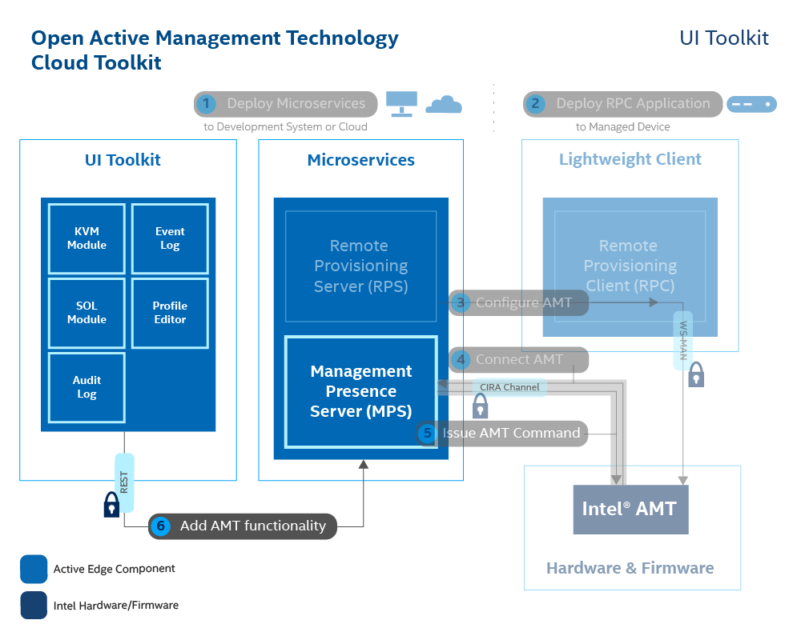

# Add MPS UI Toolkit Controls to a WebUI
The UI Toolkit allows developers to add manageability features to a console with prebuilt React components. The code snippets simplify the task of adding complex manageability UI controls, such as the Keyboard, Video, Mouse (KVM). A sample web application, based on React.js, is provided for test and development. 

The tutorial outlines how to add various controls to the sample React web application provided. Developers can use the sample code below as a springboard for developing their own consoles.

## What You'll Need

**Hardware**

At minimum, to install and utilize the ActivEdge microservices, a network configuration must include:

-  A development PC with Windows 10 or Ubuntu 18.04 or newer
-  At least one Intel® vPro device

**Software** 

- [MPS](https://github.com/open-amt-cloud-toolkit/MPS), the Management Presence Server
- [RPS](https://github.com/open-amt-cloud-toolkit/RCS), the Remote Provisioning Server
- Intel&reg; vPro device, configured and connected to MPS

>**Note:** Instructions on how to set up the MPS and RPS servers to connect a vPro device can be followed in the [Local](../Local/overview.md) or [Local Docker](../Docker/overview.md) Build and Deploy Guides.

- The **development PC** requires the following software:
    - [Chrome* Browser](https://www.google.com/chrome)
    - [git](https://git-scm.com/)
    - [Visual Studio Code](https://code.visualstudio.com/) or any other IDE
    - [Node.js](https://nodejs.org/)
  

## What You'll Do
Follow the steps in these sections sequentially: 

- Create a new React app
- Add UI controls to the React app


[](../assets/images/HelloWorld.png)

## Create a New React App

The React app can be created in any preferred development directory. The MPS can continue to run while creating and running the app.

1\. In a Command Prompt or Terminal, go to your preferred development directory. 

2\. Run the following commands to create sample React app named **my-app**.

```
npx create-react-app my-app
cd my-app
```

## Add UI Toolkit

1\. To access UI controls in the React app, open the **./my-app/package.json** file with a preferred editor, such as Visual Studio Code or Notepad.

2\. Modify the dependencies by placing a comma at the end of the last line (i.e.,"react-scripts": "3.4.3",) and add the following line:

```
"ui-toolkit": "git+https://github.com/open-amt-cloud-toolkit/ui-toolkit.git#ActivEdge"
```

2\. Save and close the file.

3\. Run the following commands to install the ui-toolkit to node-modules and run the web UI locally:

```
npm install
npm start
```

4\. By default, React apps run on port 3000. If port 3000 is already used by the MPS server or any other application, you'll be prompted to use another port. If this happens, enter 'Y'.

Sample Output:

```
You can now view my-app in the browser.
Local: http://localhost:3001
On Your Network: http://172.16.17.4:3001
```

5\. By default, React launches in your machine's default browser. However for best experience, navigate to the page using a Chrome web browser.

>**Note:** You do not need to stop the application again. It will update and refresh automatically as you make code changes.


<br>

## Add a Sample Control
The following sections outline how to add controls. To use the code snippets provided, replace what is in **App.js** file with the code snippet.

Refresh the web browser after adding a control if it does not update automatically after a few seconds.

### Add Keyboard, Video, Mouse (KVM) Redirection 

The code snippet below adds KVM control to the React application. 

1\. Open **./my-app/src/App.js** in a text editor or IDE of choice, such as Visual Studio Code or Notepad.

2\. Delete the current code and replace with the code snippet below.

3\. Change the following values:

| Field       |  Value   |
| :----------- | :-------------- |
| **deviceId** | Replace the example deviceId value with the GUID of the Intel AMT device activated and connected to your MPS server. Information on obtaining a GUID can be found [here](../Topics/guids.md). |
| **mpsServer** | Replace the *localhost* with the IP Address of your Development Device or MPS Server. Default MPS Server port is 3000. |


``` javascript hl_lines="13 14"
import React from "react";
import logo from "./logo.svg";
import "./App.css";
import { KVM, MpsProvider } from "ui-toolkit";
import '../node_modules/ui-toolkit/i18n.ts';
function App() {
  const data = {
    mpsKey: '<MPS API key>'
  };
  return (
    <div className="App">
      <MpsProvider data={data}>
        <KVM deviceId="038d0240-045c-05f4-7706-980700080009"
        mpsServer="localhost:3000/relay"
        mouseDebounceTime="200"
        canvasHeight="100%"
        canvasWidth="100%"></KVM>
      </MpsProvider>
    </div>
  );
}

export default App;
```

<br>

4\. Save and close the file.

5\. If the React app is still open in the browser and hasn't updated, refresh the page. If not already open, open Chrome and navigate to the given URLs from your successful output. By default it is `https://localhost:3001` if MPS is running on Port 3000 already.

<br>

You are now able to remotely control your Intel AMT device. Other controls such as device audit logs or profiles for RPS have example code below to test with.

<br>

## Add Other Controls
The following sections outline how to add controls. To use the code snippets provided, replace what is in **App.js** file with the code snippet.

Refresh the app after adding a control.

### Add Audit Log Control

The following code snippet shows how to add Audit Log control to the React application.
Open **src/App.js**, add the following code as show below:

> **Note:** Change **deviceId** value to your device GUID **mpsServer** value to your MPS server address and appropriate webport.

``` javascript hl_lines="14 15"
import React from "react";
import logo from "./logo.svg";
import "./App.css";
import { AuditLog, MpsProvider } from "ui-toolkit";

function App() {
  const data = {
    mpsKey: '<MPS API key>'
  };
  return (
    <div className="App">
      <MpsProvider data={data}>
        <AuditLog
        deviceId="038d0240-045c-05f4-7706-980700080009"
        mpsServer="localhost:3000"></AuditLog>
      </MpsProvider>
    </div>
  );
}

export default App;
```

### Add Device Grid Control

The following code snippet shows how to add Device Grid control to the React application.
Open **src/App.js**, add the following code as show below:

> **Note:** Change **mpsServer** value to your MPS server address and appropriate webport.

```javascript hl_lines="13"
import React from "react";
import { DeviceGrid, MpsProvider } from "ui-toolkit";
import '../node_modules/ui-toolkit/i18n.ts'

function App() {
  const data = {
    mpsKey: '<MPS API key>'
  };
  return (
    <div>
      <MpsProvider data={data}>
        <DeviceGrid
          mpsServer="localhost:3000"></DeviceGrid>
      </MpsProvider>
    </div>
  );
}

export default App;
```

### Add Serial Over LAN Control

The following code snippet shows how to add Serial Over LAN control to the React application.
Open **src/App.js**, add the following code as show below:

> **Note:** Change **deviceId** value to your device GUID **mpsServer** value to your MPS server address and appropriate webport.

```javascript hl_lines="12 13"
import React from "react";
import { SOL, MpsProvider } from "ui-toolkit";
import '../node_modules/ui-toolkit/i18n.ts'

function App() {
  const data = {
    mpsKey: '<MPS API key>'
  };
  return (
    <div>
      <MpsProvider data={data}>
        <SOL deviceId="038d0240-045c-05f4-7706-980700080009"
        mpsServer="localhost:3000"></SOL>
      </MpsProvider>
    </div>
  );
}

export default App;
```

### Add Profile Control

Open **src/App.js**, add the following code as show below:

> **Note:** Change **rpsServer** value to your RPS server address and appropriate webport.

```javascript hl_lines="13"
import React from "react";
import { Profile, RpsProvider } from "ui-toolkit";
import '../node_modules/ui-toolkit/i18n.ts'

function App() {
  const data = {
    rpsKey: '<RPS API key>'
  };
  return (
    <div>
      <RpsProvider data={data}>
        <Profile
        rpsServer="http://localhost:8081"/>
      </RpsProvider>
    </div>
  );
}

export default App;

```

### Add CIRA configs Control

Open **src/App.js**, add the following code as show below:

> **Note:** Change **rpsServer** value to your RPS server address and appropriate webport.

```javascript hl_lines="13"
import React from "react";
import { CiraEditor, RpsProvider } from "ui-toolkit";
import '../node_modules/ui-toolkit/i18n.ts'

function App() {
  const data = {
    rpsKey: '<RPS API key>'
  };
  return (
    <div>
      <RpsProvider data={data}>
        <CiraEditor
        rpsServer="http://localhost:8081"/>
      </RpsProvider>
    </div>
  );
}

export default App;

```

### Add Domain Control

Open **src/App.js**, add the following code as show below:

> **Note:** Change **rpsServer** value to your RPS server address and appropriate webport.

```javascript hl_lines="13"
import React from "react";
import { DomainEditor, RpsProvider } from "ui-toolkit";
import '../node_modules/ui-toolkit/i18n.ts'

function App() {
  const data = {
    rpsKey: '<RPS API key>'
  };
  return (
    <div>
      <RpsProvider data={data}>
        <DomainEditor
        rpsServer="http://localhost:8081"/>
      </RpsProvider>
    </div>
  );
}

export default App;

```

### Test the changes

At a command prompt navigate to the root of react app, and run the web UI locally if it has been stopped:

```
npm start
```

Go to the chrome browser, ensure controls shows up correctly.

You will see the errors in the following scenario's:

- compilation errors if ui-toolkit has not downloaded and installed to your react app.
- MPS/RPS server not running, appropriate controls fail to work.
- MPS server running and device not connected.
- If your browser is IE / Edge, there might be some compatibility issues.

<!-- ## By-pass CORS Security for testing

### MPS

To display UI controls on local react Web UI for **testing**, make the following changes to by-pass CORS.

- Go to your local **mps** application where it is running.
- Press **ctrl+c** to exit the application.
- Edit the file **mps/src/server/webserver.ts**
- Update the code as shown below to allow any origin by MPS

Search for **X-Frame-Options** and update the code as shown below

```javascript

//Clickjacking defence
this.app.use((req, res, next) => {
  //res.setHeader('X-Frame-Options', 'SAMEORIGIN');
  res.header('Access-Control-Allow-Origin', '*');
  res.header('Access-Control-Allow-Headers','*');
  if (req.method === 'OPTIONS') {
    res.header('Access-Control-Allow-Methods', '*');
    return res.status(200).json({});
  }
  next();
})

```

Search for **isAuthenticated** and comment the code as shown below

```javascript

isAuthenticated(req, res, next) {

// if (req.session.loggedin){
// return next();
// }

// if (req.header('User-Agent').startsWith('Mozilla')) {
// // all browser calls that are not authenticated
// res.redirect('/login.htm')
// return;
// }

// // other api calls
// if(req.header('X-MPS-API-Key') !== process.env.XAPIKEY){
// res.status(401).end("Not Authenticated.")
// return;
// }

// else
return next();

}

```

- Save the changes.

- At the command prompt, run the below command from the root of **mps** application

```
npm start
``` -->

<!-- ## Run RPS server in DEV mode

To display UI controls on local react Web UI for **testing**, make the following changes.

- Go to your local **rps** application where it is running.
- Press **ctrl+c** to exit the application.
- Edit the file **rps/.rpsrc**

Update the _xapikey_ value with below snippet

```
"xapikey": "APIKEYFORRPS123!"
```

- Save the changes.
- At the command prompt, run the below command from the root of **rps** application

```
npm run dev
``` -->

## Customize and create bundles

- [AuditLog](uitoolkitDocs/auditLog.md)
- [KVM](uitoolkitDocs/kvm.md)
- [Device Grid](uitoolkitDocs/DeviceGrid.md)
- [Serial Over LAN](uitoolkitDocs/SerialOverLAN.md)
- [Profile Editor](uitoolkitDocs/Profiles.md)
- [CIRA Configs](uitoolkitDocs/CIRAConfigs.md)
- [Domains](uitoolkitDocs/Domains.md)

## License Note

If you are distributing the FortAwesome Icons, please provide attribution to the source per the [CC-by 4.0](https://creativecommons.org/licenses/by/4.0/deed.ast) license obligations.
