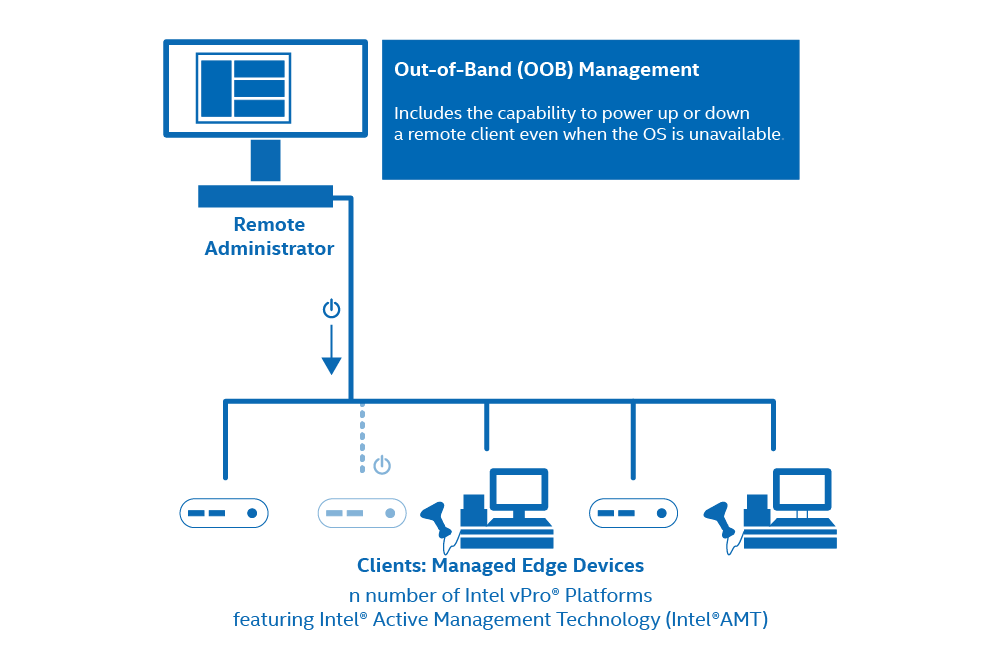

# Overview

 [**Open Active Management Technology (Open AMT) Cloud Toolkit**](Glossary.md#o) provides open-source, modular microservices and libraries for integration of hardware provisioning, [out-of-band (OOB) manageability](Glossary.md#o), and other [Intel® Active Management Technology (Intel® AMT)](Glossary.md#i). As an open source implementation, the toolkit makes it easier for IT departments and independent software vendors (ISVs) to adopt, integrate, and customize out-of-band management solutions for [Intel vPro® platforms](Glossary.md#i).

 **Figure 1: Open AMT Cloud Toolkit features out-of-band (OOB) management.**
 
## Goals
The toolkit guide provides instructions to:

- Deploy the [Management Presence Server (MPS)](Glossary.md#m) and [Remote Provisioning Server (RPS)](Glossary.md#r) on the development system.
- Build and run [Remote Provisioning Client (RPC)](Glossary.md#r)on the managed device.
- Connect the managed device (edge device)

Additional sections provide guidance on the reference implementation UI Toolkit, REST API usage, asset security, and more. 

 **Figure 2: High-level architecture consists of four major software components.**

As shown in Figure 2, Open AMT Cloud Toolkit high-level architecture consists of four components:

1. **MPS** - A microservice that uses an Intel vPro® platform feature, Client Initiated Remote Access (CIRA), for enabling edge, cloud devices to maintain a persistent connection for out-of-band manageability features, such as power control or Keyboard, Video, Mouse (KVM) control.
2. **RPS** - A microservice that activates Intel® AMT platforms using predefined profiles and connects them to the MPS for manageability use cases.
3. **RPC** - A lightweight client application that communicates with the RPS server to activate Intel® AMT.
4. **UI Toolkit** - A toolkit that includes prebuilt React components and a reference implementation web console. The React-based snippets simplify the task of adding complex manageability-related UI controls, such as the KVM, to a console. 
   
Integrate the Open AMT Cloud Toolkit into new and existing management consoles, software solutions, and more.

## Open AMT Cloud Toolkit Setup

### Build and Deploy Microservices Locally
If unfamiliar with Docker*, choose this setup option to accomplish a manual, local installation of microservices. 

[Get Started with Local Microservices](Local/overview.md){: .md-button .md-button--primary }

Estimated completion time: **Approximately 15 minutes**

### Build and Deploy Microservices with Local Docker* Images

If familiar with Docker, choose this setup option to install microservices as local Docker images. This option is an especially good choice for development systems with Docker already installed.

[Get Started with Microservices as Docker Images](Docker/overview.md){: .md-button .md-button--primary }

Estimated completion time: **Approximately 15 minutes**

Both build-and-deploy options install microservices locally on a development system. The client application is installed on a managed device. Experienced Docker users may choose to deploy microservices straight to the [cloud](Docker/dockerCloud.md).
 
-------
## Additional Intel® AMT Resources

For additional information about Intel® AMT, see the following links:

- [Intel vPro® Platform Overview](https://software.intel.com/content/www/us/en/develop/topics/iot/hardware/vpro-platform-retail.html)
- [Video Link](https://www.intel.com/content/www/us/en/support/articles/000026592/technologies.html)
- [Detailed Setup document](https://software.intel.com/en-us/articles/getting-started-with-intel-active-management-technology-amt)

