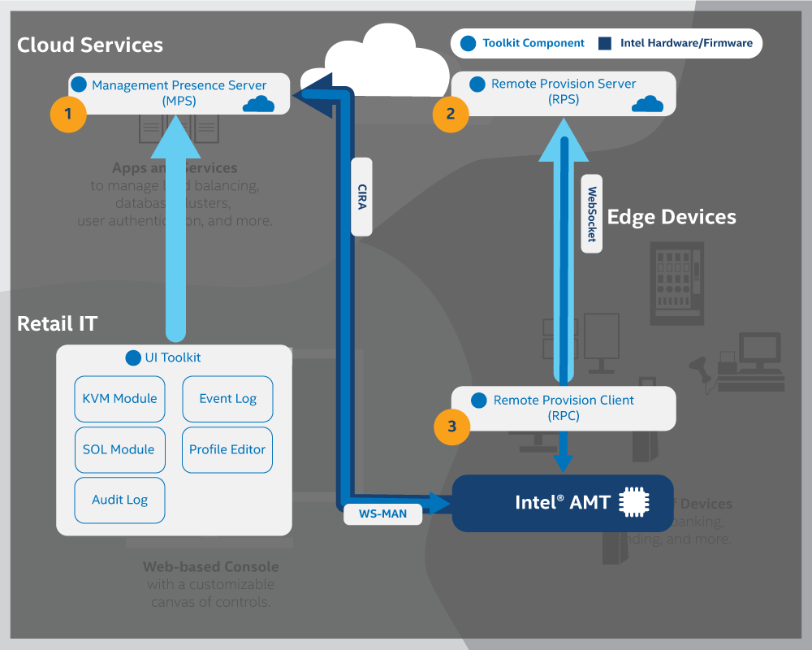

# ActivEdge Overview

Intel® vPro™ Platforms offer hardware-enhanced security features and remote manageability, also known as out-of-band manageability, using Intel® Active Management Technology (Intel&reg; AMT). With Intel&reg; AMT, administrators remotely manage, repair, and update network assets, such as systems and edge devices. In the event that a network asset is powered off or the operating system is unavailable, administrators can power on the asset. 

ActivEdge provides modular microservices and libraries for integration of hardware provisioning, out-of-band manageability, and other Intel&reg; AMT features with both new and existing management consoles, software solutions, and more. As an open source implementation, ActivEdge makes it easier for IT departments and ISVs to adopt, integrate, and customize out-of-band management solutions for Intel® vPro™ Platforms.

Read more about Intel&reg; AMT features and capabilities [here](https://software.intel.com/content/www/us/en/develop/topics/iot/hardware/vpro-platform-retail.html).

## Goals

By the end of this guide, you will have gained experience using these three core modules, shown in Figure 1:

**Figure 1: ActivEdge Components**

1. **Management Presence Server (MPS)** - A microservice that utilizes an Intel vPro&reg; feature, Client Initiated Remote Access (CIRA), for enabling edge, cloud devices to maintain a persistent connection for out-of-band manageability features such as power control or KVM control
2. **Remote Provisioning Server (RPS)** - A microservice that activates Intel&reg; AMT-based platforms using pre-defined profiles and connects them to the MPS for manageability use cases
3. **Remote Provisioning Client (RPC)** - A lightweight client application that communicates with the RPS server to activate Intel&reg; AMT

## ActivEdge Setup

### Build and Deploy Microservices Locally
If unfamiliar with Docker, choose this setup option to accomplish a manual, local installation of microservices. 

[Get Started with Local Microservices](Local/overview.md){: .md-button .md-button--primary }

**Estimated completion time:** Approximately 15 minutes

### Build and Deploy Microservices with Local Docker* Images

If familiar with Docker, choose this setup option to install microservices as local Docker images. This option is an especially good choice for development systems with Docker already installed.

[Get Started with Microservices as Docker Images](Docker/overview.md){: .md-button .md-button--primary }

**Estimated completion time**: Approximately 15 minutes

Both build-and-deploy options install microservices locally on a development system. The client application is installed on a managed device. Experienced Docker users may choose to deploy microservices straight to the [cloud](Docker/dockerCloud.md).
 
-------
## Additional Intel® AMT Resources

For additional information about Intel® AMT, see the following links:

- [Intel® vPro Overview](https://software.intel.com/content/www/us/en/develop/topics/iot/hardware/vpro-platform-retail.html)
- [Video Link](https://www.intel.com/content/www/us/en/support/articles/000026592/technologies.html)
- [Detailed Setup document](https://software.intel.com/en-us/articles/getting-started-with-intel-active-management-technology-amt)

