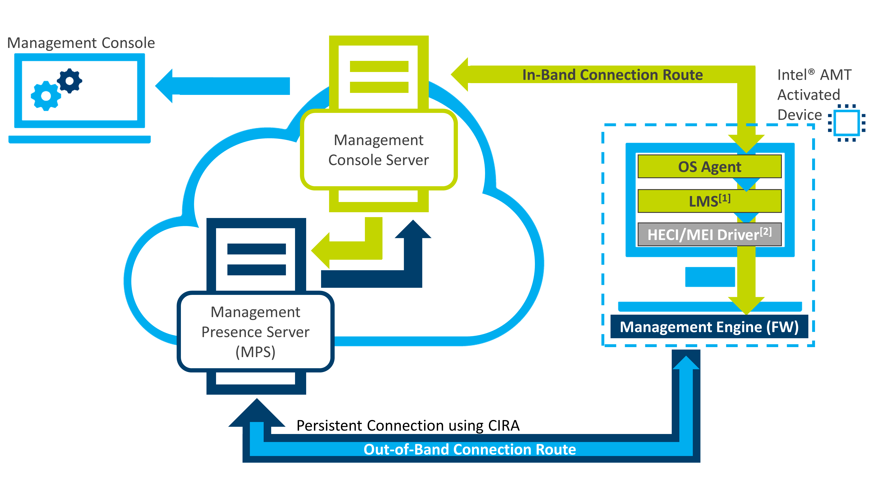
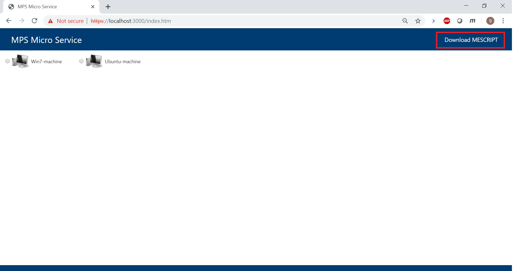
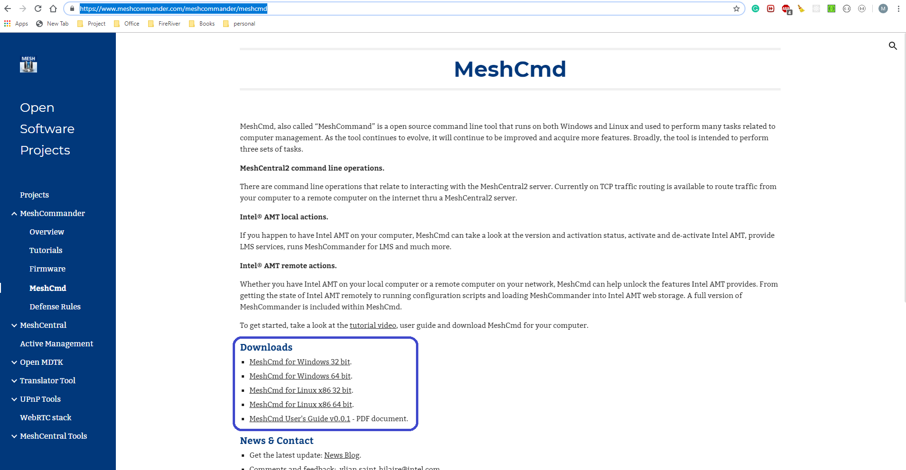
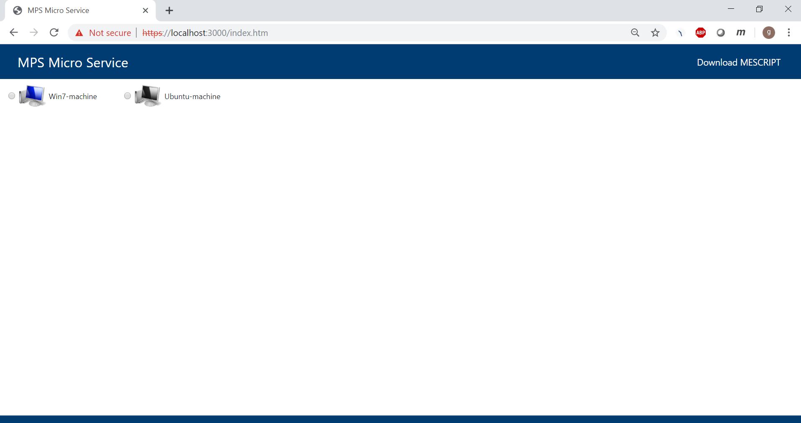

# Get started

The instructions in this document offers the following guidance:

* Set up the Management Presence Server
* Modify json configuration sample files
* Connect to an activated AMT device

## Overview of the Management Presence Server (MPS)
The Management Presence Server is a cloud agnostic micro-service that enables Intel&reg; AMT-based platforms connectng over the 
The image below is a representation of using MPS server connected to an activated AMT device.

[](assets/images/mpsdiagram_final.png)

## Requirements for MPS Server

### Software Requirements

* [git](https://git-scm.com/downloads)
* [node.js v10 or greater](https://nodejs.org/dist/latest-v10.x/)

### Hardware Requirements

* [Activated Device with Intel&reg; AMT](activateAMT.md)
* Computer or device used to connect to MPS server
* Computer or device to connect the client console

### Supported Platforms
The MPS server can run on all platforms that support node.js. One consideration is exposing ports on the server used to run MPS. Typically, these are:

* 3000
* 4433 

## MPS Server: Set Up

The instructions below are performed on the MPS server. To begin, run a platform that supports nodejs. 

Example:

* Virtual Machine with nodejs support
* Dedicated Server with nodejs support

Once the software pre-requisites are met for the MPS, you can begin the rest of the set up of MPS. 
### 1. Clone the repository
```
git clone https://github.com/open-amt-cloud-toolkit/MPS.git
cd MPS
```

### 2. Add/modify config.json

Navigate to the private directory within the MPS directory,
```
cd ~/MPS/private
```

Create a **config.json** file.
     *Copy the example file in the directory.

```
cp config.json.example config.json
```

These following parameters can be configured.

| Option       |  Description    |
| :----------- | :-------------- |
| **usewhitelist** | set to true to whitelist AMT GUIDs stored in guids.json |
| **commonName** | used in self signed certificate, can be either FQDN or IP address |
| **mpsport** | port |
| **mpsusername** | new username for mpsusername set during this current process |
| **mpspass** | new password for the user set during this current process
| **useglobalmpscredentials** | When set to true, any device using **mpsusername** and  *mpspass* in config.json are allowed to connect. When set to false, MPS validates credentials sent by AMT device using credentials.json.
| **country** | name of country |
| **company** |  name of company |
| **debug** | debug option set to true or false |
| **listenany** | listen to any set to true or false |
| **https** | set to true to enable TLS on HTTP server |
| **mpstlsoffload** | set to true to run MPS without TLS |
| **webport** | Port used by WebServer (or HTTP server) |
| **generateCertificates** | Generates certificates automatically. When set to true, SSL and Root cert are generated and stored in private folder |
| **loggeroff**: | Logging is enabled by default. Set to **true** to disable logging. |

mpusername and mpspass can be set to whatever credentials you choose to set, at this time. This will math the mpsusername and mpspass in other config files edited during this process.

For example:

```

        {
                "usewhitelist" : false,
                "commonName": "iot-demosetup.lab.local.com",
                "mpsport": 4433,
                "mpsusername": "standalone",
                "mpspass": "G@ppm0ym",
                "useglobalmpscredentials": true,
                "country": "US",
                "company": "NoCorp",
                "debug": true,
                "listenany": true,
                "https": true,
                "mpstlsoffload": false,
                "webport" : 3000,
                "generateCertificates": true,
                "loggeroff": true
        }

```

### 3. Add/modify credentials.json

If not in the ~/MPS/private directory, navigate to the private directory within the MPS directory.

```
cp credentials.json.sample credentials.json
```

**AMT GUID**

Each AMT device has a unique identifier (GUID) assigned to it by default. This GUID will be used as the reference to each device record. 

To obtain the GUID on the AMT device, open a command prompt, navigate to where meshcmd.exe resides, and run ```meshcmd amtuuid```. The GUID will display.


| Option       |  Description    |
| :----------- | :-------------- |
| **name** | AMT hostname or user friendly identifier |
| **mpsuser** | AMT Device uses this as the user name while connecting to MPS. This is set once by the developer |
| **mpspass** | AMT Device uses this as the password while connecting to MPS. This is set once by the developer |
| **amtuser** | MPS uses this as the AMT user name when making AMT API calls (WSMAN or Redirection). This is the username set in the AMT configuration |
| **amtpass** | MPS uses this as the AMT password when making AMT API calls (WSMAN or Redirection). This is the password set during AMT configuration |

!!! info "AMT and MPS password security recommendation"

Intel highly recommends that you don't use same password for MPS AMT. An example strong password would contain:

* at least eight characters
* at least one uppercase letter
* one lowercase letter
* one digit
* one special character


For example:

``` yaml

        {
        "8dad96cb-c3db-11e6-9c43-bc0000d20000": {
            "name": "Win7-machine",
            "mpsuser": "standalone",
            "mpspass": "G@ppm0ym",
            "amtuser": "admin",
            "amtpass": "G@ppm0ym"
        },
        "bf49cf00-9164-11e4-952b-b8aeed7ec594": {
            "name": "Ubuntu-machine",
            "mpsuser": "xenial",
            "mpspass": "G@ppm0ym",
            "amtuser": "admin",
            "amtpass": "G@ppm0ym"
        }
    }

```

### 4. Add/modify guids.json

If *usewhitelist* is set to *true* in the config.json file, add a guids.json file in *private* directory to whitelist AMT GUIDs that are allowed to connect to MPS. 

Use **guids.json.sample** as an reference to create the guids.json and populate it with guids for whitelisting. This file is used to simulate whitelisting based on AMT GUIDs.

Navigate to the ~/MPS/private directory.

```
cd ~/MPS/private
```

Create the guids.json file.

```
cp credentials.json.sample credentials.json
```

Edit this file to include your GUID(s). The GUID can be found using meshcommander. On the device with AMT activated, change to the directory where meshcmd.exe was downloaded. For example 


For example:

```yaml

["8dad96cb-c3db-11e6-9c43-bc0000d20000","12345678-9abc-def1-2345-123456789000"]
```

### 5. Start the server

Navigate to the MPS directory. Run the following commands:

``` javascript
npm install
npm start
```

This will install all the dependencies and start the server. Webserver (or HTTPS server) runs on port 3000 by default and MPS Server listens on port 4433.
Certificates are generated and stored in private folder.

[](assets/images/MPS_npminstall.PNG)

### 6. Connect an AMT device

*  Make sure the AMT device is connected to the internet.

*  On the device, browse to the MPS server using the IP address or domain 
	
<strong>Example URL</strong>: https://MPS-IPaddress:3000
 
* Click <strong>Download MESCRIPT</strong>. 
* This will download a <strong>cira_setup.mescript</strong> file.

!!! info "MEScript"
        MEScript files are used by MeshCMD to execute a series of actions on the AMT device.

[](assets/images/MPS_DownloadMEScript.PNG)

*  Next, locate the meshcommander.exe download previously.

[](assets/images/MPS_MeshCommander.PNG)

*  Browse to the folder where MEScript and MeshCMD are downloaded. Open an elevated or administrator command prompt or cli. Run the below command. This runs a script that does all the configuration required for CIRA setup.
    1. Specifies the **root certificate** that the Firmware (ME) should use for TLS negotiation.
    2. Specifies the **login credentials** that the Firmware should use when connecting to MPS.
    3. Specifies the **periodic connection** time the Firmware should use to maintain MPS connection.
    4. Specifies the **home domain suffix** used to enable environment detection (When device is outside the home domain, AMT uses CIRA to connect to MPS).

``` yaml
    meshcmd.exe amtscript --script cira_setup.mescript --pass <amt password>
```

*  The device will now connect to the MPS Server.

[](assets/images/MPS_DeviceOnline.PNG)

!!! info "Device credentials"

    Make sure that AMT guid entry is present in credential.json file. Also include the AMT guid in guids.json file if *usewhitelist* is set to *true* in config.json file.
